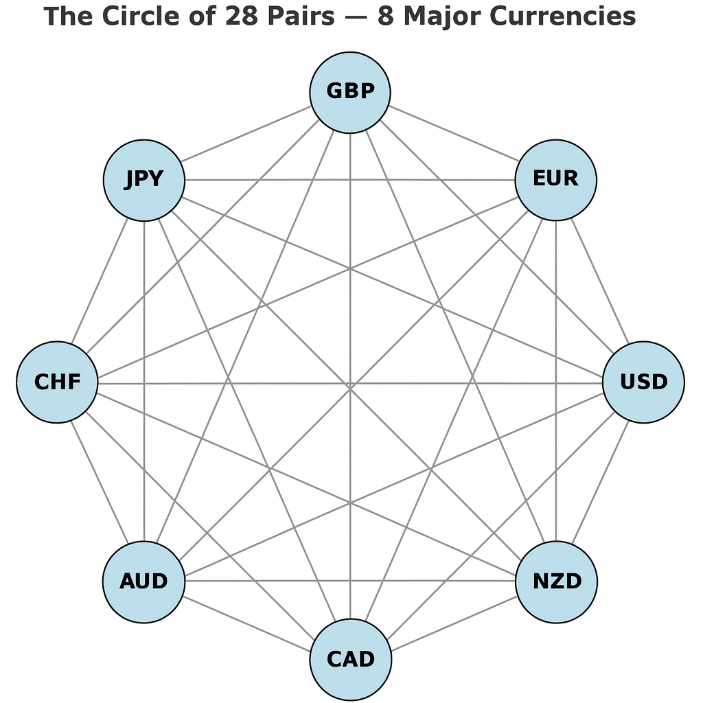

# RF‑FXTTS Whitepaper  
### *Ricci Flow FX Topological Trading System*

Welcome to the official public release of the **RF‑FXTTS Whitepaper**, a structural, topological and ecosystem‑based model of the FX market.

This site provides an accessible, web‑friendly version of the project and links to the full documentation.

---

## 📄 Full Whitepaper

You can read the complete whitepaper here:
👉 **[RF‑FXTTS Whitepaper (Markdown)](./whitepaper/RF-FXTTS-Whitepaper.md)**

## The 8‑Currency Ecosystem (K₈ Topology)

## 📘 EA Documentation
👉 [RF‑FXTTS Expert Advisor Documentation](./EA_Documentation.md)

📄 EA Source Code: [RSI_Trend.mq4](./EA/RSI_Trend.mq4)

## 🧠 What is RF‑FXTTS?

## Risk Distribution Across 28 Pairs

RF‑FXTTS models the FX market not as 28 isolated currency pairs, but as a **closed 8‑currency ecosystem** — a complete graph (K₈) with 28 structural edges.

The system describes:

- pressure flow  
- structural deformation  
- correlation displacement  
- symmetry restoration  
- Ricci‑like smoothing cycles  

This creates a **prediction‑free**, antifragile trading architecture based on structural alignment.

---

## Repository Structure

- **EA/**
  - `RSI_Trend.mq4` — Expert Advisor source code

- **images/**  
  Diagrams and illustrations used in documentation

- **whitepaper/**
  - `RF-FXTTS-Whitepaper.md` — Full theoretical whitepaper

- `EA_Documentation.md` — Full EA technical documentation  
- `index.md` — GitHub Pages landing page  
- `README.md` — Project overview  
- `LICENSE` — License information

## 🌐 About the Author

**Dzintars Ansons**  
Quantitative Trading System Architect  
Topological & structural FX modeling
### 📘 Related Work by the Author

This project is conceptually connected to the author's book:

**The Gospel of Financial Nirvana:  
The Path Out of the Wheel of Financial Samsara**

The book explores how most market participants remain trapped in a recurring cycle of expectation, fear, profit, and loss — a financial analogue of samsara.  
Its core message aligns with the RF‑FXTTS paradigm:

- prediction cannot control the market  
- errors are inevitable and structurally necessary  
- clarity and boundaries matter more than forecasts  

The RF‑FXTTS ecosystem translates these principles into practice —  
replacing prediction with structure, and control with viability.

📘 Amazon:
https://www.amazon.com/Gospel-Financial-Nirvana-Wheel-Samsara-ebook/dp/B0FPXN788J

---

Thank you for exploring the RF‑FXTTS paradigm.
